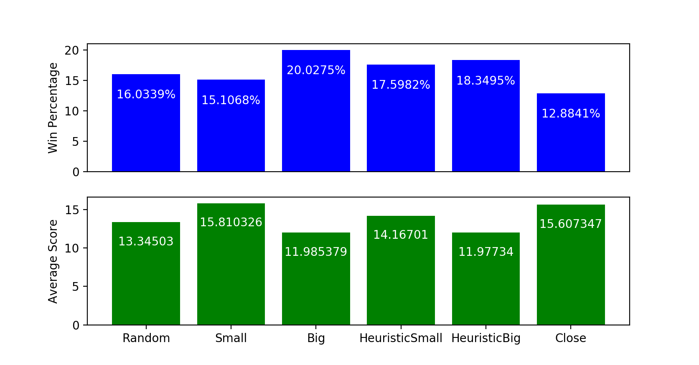

# Take 6 Simulation
This is a quick way to test out various strategies for the game [Take 6](https://en.wikipedia.org/wiki/6_Nimmt!).

## Results
Here are the results for the strategies I came up with after 1 million games played:

## Strategies
The five strategies tested are quite simple. `Random` is simply playing a random card each game. `Small` is always picking its smallest card. `Big` is always picking its biggest card. `HeuristicSmall` is generally picking its smallest card, except when that card will play on a row that already contains 5 cards. If that is the case, it will select its smallest card that fits on a row of 4 or less. If all rows are rows of 5, then it will pick the card that has the greatest distance with the last card of each row. `HeuristicBig` does the same as `HeuristicSmall`, except it generally tries to play its largest card.

## Conclusion
Surprisingly (to me, at least), it seems that the `Big` strategy seems to work best (given that we want to minimize our points).